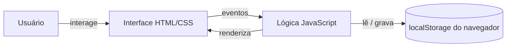
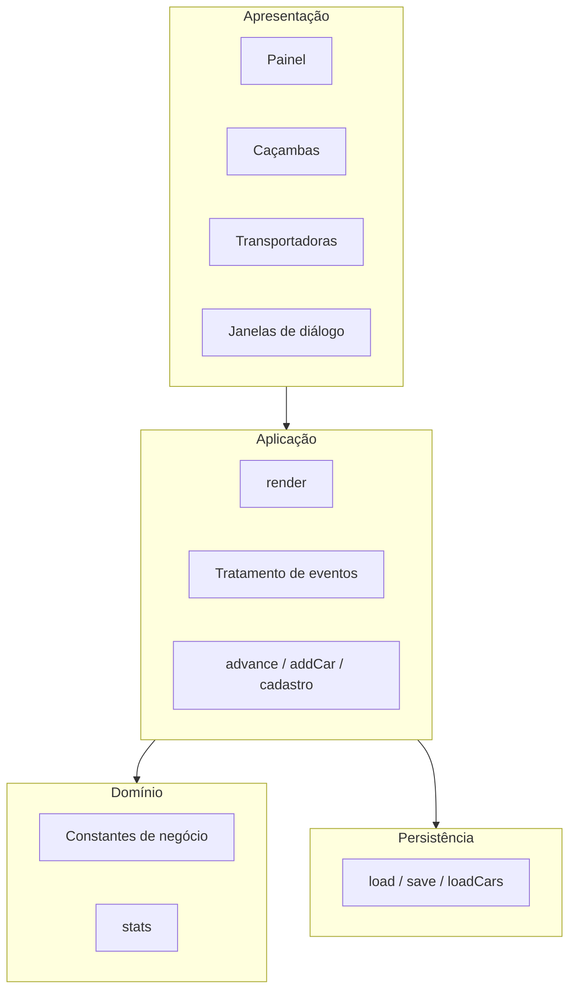
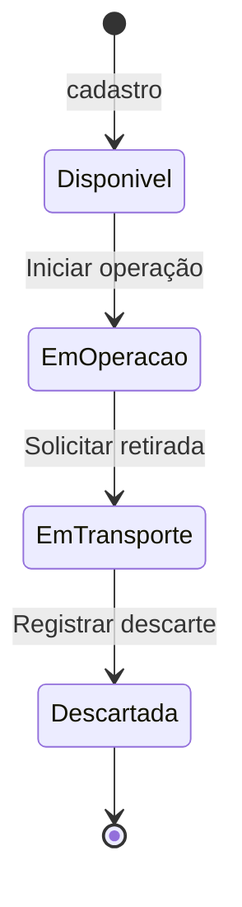
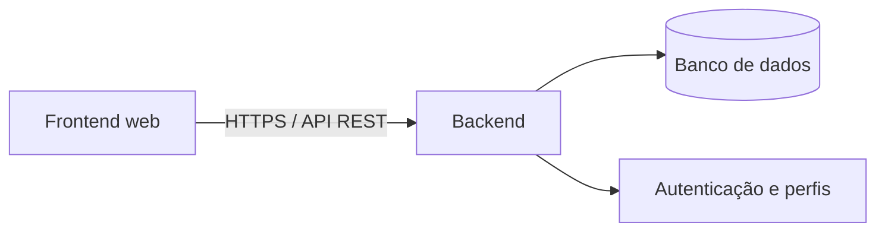

# Documento de Arquitetura – SGF Resíduos

| Campo | Descrição |
|---|---|
| **Sistema** | SGF Resíduos – Rastreio e descarte de caçambas por transportadora |
| **Versão do documento** | 1.0 (MVP frontend) |
| **Natureza** | Aplicação web de página única (SPA), executada integralmente no navegador |
| **Idioma da interface** | Português do Brasil |

---

## 1. Introdução

### 1.1 Finalidade

Este documento descreve a arquitetura do MVP (Produto Mínimo Viável) do **SGF Resíduos**, aplicação voltada ao controle do ciclo de vida de caçambas estacionárias de resíduos, desde a disponibilização até o descarte final, com atribuição de cada caçamba a uma transportadora responsável.

O texto tem dois objetivos: (i) explicar como o sistema está organizado e por que foi construído dessa forma; e (ii) servir de base para as próximas etapas de evolução, em especial a migração para uma arquitetura com backend.

### 1.2 Escopo

O MVP cobre exclusivamente a camada de **frontend**. Não há servidor, banco de dados, autenticação ou integração com sistemas externos. Toda a lógica de negócio, a apresentação e a persistência residem no navegador do usuário.

### 1.3 Objetivos de negócio atendidos

1. Registrar caçambas e vinculá-las a uma transportadora, a um cliente/obra e a um tipo de resíduo.
2. Acompanhar a situação de cada caçamba ao longo de um fluxo de quatro etapas.
3. Registrar o descarte com o **peso total** e o **destino final** do resíduo.
4. Consolidar indicadores operacionais, por frota e por transportadora.
5. Manter o cadastro de transportadoras.

---

## 2. Visão geral da solução

### 2.1 Estilo arquitetural

A solução adota o estilo de **aplicação cliente monolítica** (*client-side only*), composta por um único arquivo HTML autocontido (aproximadamente 220 linhas), que reúne estrutura (HTML), apresentação (CSS) e comportamento (JavaScript). Não há dependências externas, ferramenta de compilação nem framework.

Essa escolha privilegia:

- **Simplicidade de distribuição:** basta abrir o arquivo em um navegador.
- **Rapidez de validação:** permite testar o fluxo operacional com usuários antes de investir em infraestrutura.
- **Custo zero de execução:** não exige hospedagem de servidor.

### 2.2 Diagrama de contexto

---

## 3. Arquitetura lógica

O código está organizado em camadas conceituais, ainda que residam no mesmo arquivo.

### 3.1 Camada de apresentação

Responsável pela estrutura visual e pela interação. Compreende:

- **Cabeçalho fixo** com o nome do sistema, o botão de cadastro de caçamba e a navegação por abas.
- **Área principal (`<main>`)**, cujo conteúdo é substituído a cada mudança de aba ou de estado.
- **Três janelas de diálogo** (elemento nativo `<dialog>`): nova caçamba, nova transportadora e registro de descarte.

O estilo é definido em CSS com **variáveis de design** (cores, bordas, fundos) declaradas em `:root`, o que centraliza a identidade visual e facilita futuras alterações de tema.

### 3.2 Camada de aplicação

Coordena as ações do usuário e a atualização da tela. Seus componentes principais:

| Função | Responsabilidade |
|---|---|
| `render()` | Reconstrói as abas e o conteúdo da visão ativa. |
| `advance()` | Avança a caçamba selecionada para a próxima etapa e registra o evento no histórico. |
| `addCar()` | Valida e cadastra uma nova transportadora. |
| Manipulador de clique (delegado) | Interpreta ações por atributos `data-*` (troca de aba, avanço de etapa, histórico, fechar diálogo, nova transportadora). |
| Manipulador de digitação | Aplica os filtros da aba Caçambas em tempo real. |

### 3.3 Camada de domínio

Concentra as regras e os vocabulários do negócio:

- **Status (`ST`):** Disponível, Em operação, Em transporte, Descartada.
- **Ações de transição (`NEXT`):** Iniciar operação, Solicitar retirada, Registrar descarte.
- **Tipos de resíduo (`TIPOS`):** Entulho, Madeira, Metal, Plástico, Papel, Orgânico.
- **Destinos finais (`DEST`):** Reciclagem, Reuso, Aterro Classe A, Aterro sanitário, Coprocessamento.
- **`stats(lista)`:** calcula os indicadores (total, ativas, em transporte, descartadas e peso total descartado) para um conjunto de caçambas, seja a frota inteira, seja uma transportadora.

### 3.4 Camada de persistência

Utiliza o `localStorage` do navegador, com duas chaves independentes:

| Chave | Conteúdo |
|---|---|
| `sgf-residuos-v1` | Lista de caçambas, incluindo histórico. |
| `sgf-residuos-transportadoras-v1` | Lista de nomes das transportadoras. |

Toda leitura e escrita é protegida por `try/catch`. Se o armazenamento estiver indisponível ou vazio, o sistema carrega dados de exemplo (*seed*) e continua funcional. A função `load()` também migra registros antigos que usavam o status "Em obra" para "Em operação".

---

## 4. Modelo de dados

### 4.1 Caçamba

| Campo | Tipo | Descrição |
|---|---|---|
| `id` | texto | Identificador sequencial no formato `CX-nnn`. |
| `carrier` | texto | Nome da transportadora responsável. |
| `obra` | texto | Nome da obra ou cliente atendido. |
| `tipo` | texto | Tipo de resíduo (um dos valores de `TIPOS`). |
| `status` | texto | Etapa atual (um dos valores de `ST`). |
| `peso` | número | Peso total descartado, em kg. Vale 0 enquanto não houver descarte. |
| `destino` | texto | Destino final (um dos valores de `DEST`). Vazio enquanto não houver descarte. |
| `hist` | lista | Eventos de mudança de etapa: `{ s: status, d: data ISO }`. |

### 4.2 Transportadora

Representada apenas pelo **nome** (texto). O vínculo com a caçamba é feito por esse nome.

### 4.3 Observação

O modelo atual é deliberadamente simples. As limitações decorrentes (por exemplo, vínculo por nome em vez de identificador) estão registradas em `DIVIDA_TECNICA.md`.

---

## 5. Fluxo de negócio

O ciclo de vida da caçamba é uma **máquina de estados linear**, sem retorno:

| Etapa | Significado |
|---|---|
| **Disponível** | A caçamba está no pátio da transportadora, livre para locação. |
| **Em operação** | A caçamba foi entregue ao cliente e está recebendo resíduos. |
| **Em transporte** | A caçamba cheia foi retirada e segue para o destino. |
| **Descartada** | O resíduo chegou ao destino, teve o peso total registrado e o destino final definido. |

A transição de "Em transporte" para "Descartada" é a única que exige dados adicionais (**peso total** e **destino final**), coletados na janela de descarte. O peso deve ser maior que zero.

---

## 6. Interface e navegação

A aplicação organiza-se em três abas.

### 6.1 Painel

Visão consolidada da operação, com cinco indicadores:

1. Caçambas ativas (todas as que não estão descartadas);
2. Caçambas descartadas;
3. Caçambas em transporte;
4. Transporte concluído;
5. Total descartado, em kg.

Complementam o painel a **barra de situação da frota** (distribuição por status) e o gráfico de **peso descartado por tipo de resíduo**.

### 6.2 Caçambas

Lista em cartões, com busca textual (código, obra ou tipo de resíduo) e filtros por status e por transportadora. Cada cartão exibe o código, o tipo, o cliente/obra, a transportadora, o indicador visual de progresso em quatro etapas, o botão da próxima ação e o histórico de datas.

### 6.3 Transportadoras

Cartões com o resumo de cada transportadora (total, ativas, descartadas, em transporte, transporte concluído e total descartado em kg) e o botão **+ Nova transportadora**, que abre a janela de cadastro com validação de campo vazio e de nome duplicado.

---

## 7. Fluxo de dados e eventos

O sistema segue um ciclo unidirecional simples:

1. O usuário realiza uma ação (clique ou digitação).
2. O manipulador de eventos identifica a ação e altera o estado em memória.
3. A função `save()` grava o estado no `localStorage`.
4. A função `render()` reconstrói a visão atual a partir do estado.

A captura de cliques usa **delegação de eventos**: um único ouvinte no documento interpreta atributos `data-*`, o que dispensa ligar manipuladores a cada botão criado dinamicamente.

---

## 8. Requisitos não funcionais

### 8.1 Responsividade

O layout usa CSS Grid com `auto-fit` e `minmax`, adaptando-se de celulares a telas amplas sem pontos de quebra fixos. A navegação por abas rola horizontalmente em telas estreitas, e o cabeçalho respeita as áreas seguras de dispositivos móveis (`safe-area-inset`).

### 8.2 Desempenho

Por operar com poucos registros e sem chamadas de rede, o desempenho é imediato. A renderização total a cada mudança é aceitável nessa escala, mas não escala para grandes volumes.

### 8.3 Segurança

- Os textos inseridos pelo usuário são sanitizados por uma função de escape (`esc`) antes de compor HTML.
- Não há autenticação nem controle de acesso: qualquer pessoa com acesso ao navegador pode ler e alterar os dados.
- Os dados não saem do dispositivo.

### 8.4 Portabilidade

Executa em qualquer navegador moderno, sem instalação. Depende de `localStorage` e do elemento `<dialog>`.

---

## 9. Limitações e evolução

O MVP valida o fluxo operacional, mas não substitui um sistema de produção. As principais limitações são:

- dados restritos a cada navegador, sem compartilhamento entre usuários;
- ausência de autenticação, perfis e trilha de auditoria;
- ausência de edição e exclusão de caçambas e transportadoras;
- vínculos por nome, sem identificadores próprios.

O inventário completo, com classificação de risco e sequência sugerida de liquidação, está em **`DIVIDA_TECNICA.md`**.

### 9.1 Arquitetura-alvo sugerida

A evolução natural é separar o frontend de um backend com banco de dados relacional, entidades próprias (Transportadora, Cliente/Obra, Caçamba, Evento) e autenticação por perfis, preservando o fluxo de estados já validado no MVP.

---

## 10. Glossário

| Termo | Definição |
|---|---|
| **Caçamba** | Contêiner estacionário usado para armazenar e transportar resíduos. |
| **Transportadora** | Empresa responsável por entregar, retirar e destinar a caçamba. |
| **Descarte** | Etapa final, em que o resíduo é entregue ao destino e pesado. |
| **Coprocessamento** | Uso de resíduos como insumo energético ou matéria-prima em processos industriais. |
| **SPA** | *Single Page Application*: aplicação que atualiza a tela sem recarregar a página. |
| **MVP** | Produto Mínimo Viável. |
